# RAG voor iedereen
### Kennisweek RVB · workshop van 2 uur

<!--
Timing (±120 min): intro 10 · ML 15 · taalmodel 10 · RAG-keten 40 · pauze 5 · van chat naar toepassing 25 · FormIt/soevereiniteit 10 · afsluiting 5.
Open met: "Aan het eind kan iedereen de hele keten navertellen en goed van matig onderscheiden."
-->

---

## voorstellen

---

## Even peilen: handen omhoog 👋

- Wie gebruikt AI **thuis**?

---

## Even peilen: handen omhoog 👋

- Wie gebruikt **Vlam-chat** op het werk?

---
## Even peilen: handen omhoog 👋

- Bij wie rinkelt er een belletje bij **"RAG"**?

<!--
Ja: ik ga de diepte in en jullie krijgen een RAG-tool om buiten werk te verkennen.
Nee: ik leg het simpel uit. Ook nuttig voor wie het kent: hergebruik de voorbeelden tot iedereen het kent en goed van matig kan onderscheiden.
-->

---

## Wat krijg je vandaag?

- Toegang tot een RAG-tool (**FormIt**) om te verkennen
- De slides
- Ik bouw op, maar ga snel. Veel kleine onderdelen: haak gewoon weer aan bij het volgende

<!-- Eerlijk zijn: mogelijk te snel. Dat is OK. -->

---

## demo tijd! (verkorte versie)
* filmpje  https://youtu.be/AXkbS8AO9nc 
* echte app https://okeribok.github.io/FormIt/

---

## Afspraken

- Vragen in de **chat**
- **Wie is mijn jargon-bewaker?**
  - Vergeet ik een term uit te leggen? Zeg het hardop
- Veel Engelse termen: je hoeft ze niet te kennen, alleen te weten dat ze zo heten

<!-- Jargon-bewaker: handje + chat. Geef die persoon een rol: "roep 'jargon!'" -->

---
## Even peilen: handen omhoog 👋

Ooit een AI-antwoord gezien dat zelfverzekerd klonk maar fout was? Ooit gedacht "waar komt dit vandaan?"

---

## Het probleem met "gewoon een chatbot"

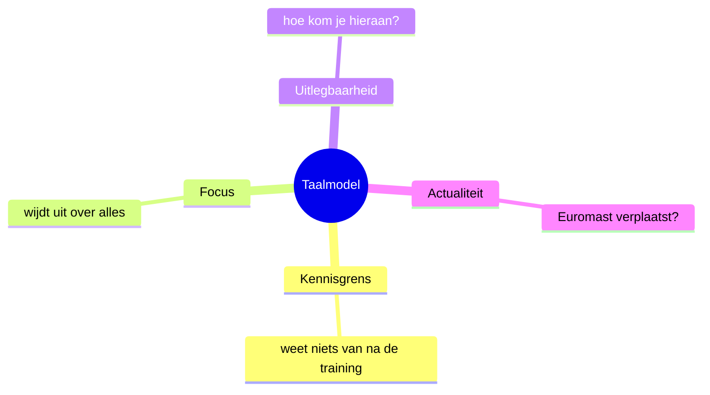

<!--
Handje op: ooit een AI-antwoord gezien dat zelfverzekerd klonk maar fout was? Ooit gedacht "waar komt dit vandaan?"
Dit zijn de vier problemen die RAG aanpakt.
-->

---

## RAG in één zin

**Retrieval Augmented Generation**

Het model **gokt niet** uit vage herinnering, maar gebruikt **aanwijsbare kennis** om te antwoorden.

Dat heet: **grounded**.

<!--
Retrieval = ophalen, Augmented = aangevuld, Generation = schrijven.
Eerst het fundament: hoe werkt AI eigenlijk? Daarna komt RAG vanzelf.
-->

---

# Deel 1
## Hoe leert een machine?

---

## Je opent een pizzarestaurant 🍕

Reviews in gen-alpha brainrot:

> "Deze pizza is **skibidi**."
> "Echt **Bombardiro Crocodilo**-niveau."

Wie weet wat dat betekent? **De computer niet.**

Doel: bouw een model dat zegt: review **goed (1)** of **slecht (0)**.

<!--
Laat de zaal raden. Het punt: wij weten het uit ervaring, de machine moet het leren uit voorbeelden.
-->

---

## Stap 1: voorbeelden verzamelen

| Term | Betekent |
|------|----------|
| FIRE | goed (1) |
| GOAT | goed (1) |
| MID | slecht (0) |
| CRINGE | slecht (0) |

Dit heet de **trainingsdata**: bekende voorbeelden met het juiste antwoord.

---

## Stap 2: tokenization (expres naïef)

Elke letter wordt een getal: **A=1, B=2, C=3 …** en we tellen op.

| Term | Som | Label |
|------|-----|-------|
| FIRE | 6+9+18+5 = **38** | 1 |
| GOAT | 7+15+1+20 = **43** | 1 |
| MID | 13+9+4 = **26** | 0 |
| CRINGE | 3+18+9+14+7+5 = **56** | 0 |

<!--
Tokenization = tekst omzetten in getallen die een machine kan verwerken.
Let op: dit is bewust dom. Straks zien we waarom dat ertoe doet.
-->

---

## Stap 3: de computer bedenkt een formule

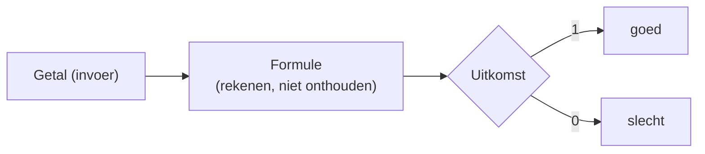

De **formule** is het "model". Het moet voor **alle** voorbeelden tegelijk kloppen.

<!--
Belangrijk: het model onthoudt niet, het rekent. Een formule die van 38 naar 1 komt en van 26 naar 0.
-->

---

## Stap 4: trainen = steeds opnieuw rekenen

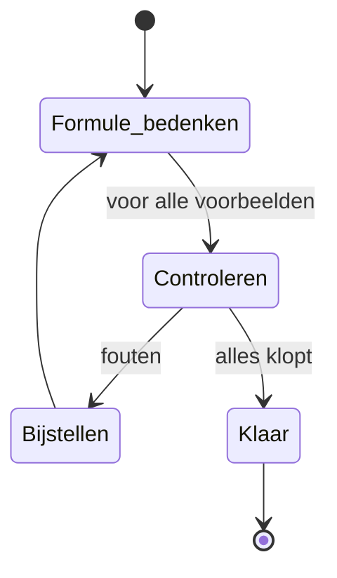

Nieuwe regel erbij? **Alles opnieuw.**

<!--
Verklaart: waarom ML zoveel rekenkracht kost en waarom je een getraind model niet "even" aanpast. Het resultaat is een bevroren formule.
-->

---

## Wat dit ons leert

1. **Rekenkracht**: elke nieuwe regel betekent opnieuw rekenen
2. **Een model is bevroren**: je pas het niet zomaar aan, je traint opnieuw
3. **Tokenization telt**: TOP en POT hebben dezelfde som (**51**)
4. **Splits je data**: train op een deel, **test op een deel dat het model nooit zag**

<!--
Punt 3: onze naïeve tokenizer ziet geen verschil tussen anagrammen. Hoe je tekst omzet bepaalt hoe goed het model met nieuwe invoer omgaat.
Punt 4: leerlingen die het proefwerk al kennen scoren altijd goed. Dat zegt niets.
-->

---

## Train/test-split

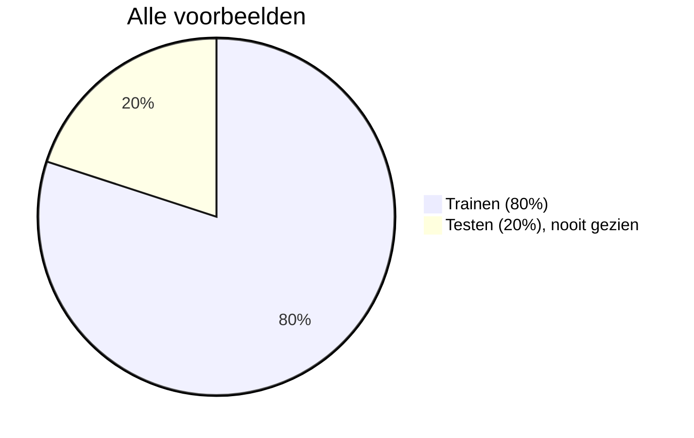

<!-- Handje op: "het model onthoudt alles wat het ooit heeft gezien." Nee: het heeft een formule, geen archief. -->

---

# Deel 2
## Hoe werkt een taalmodel?

---

## Een taalmodel voorspelt het volgende woord

> "De Euromast staat in ..."  → **Rotterdam**

> "Het weer voor morgen is ..." → *een antwoord, maar klopt het?*

> De Euromast wordt verplaatst → **het model weet het niet**

<!--
Eerste modellen maakten zinnen af. Goed als het in de trainingsdata stond. Handje op: "als de Euromast morgen verplaatst wordt, weet het model dat meteen."
-->

---

## Van zinnen afmaken naar instructies

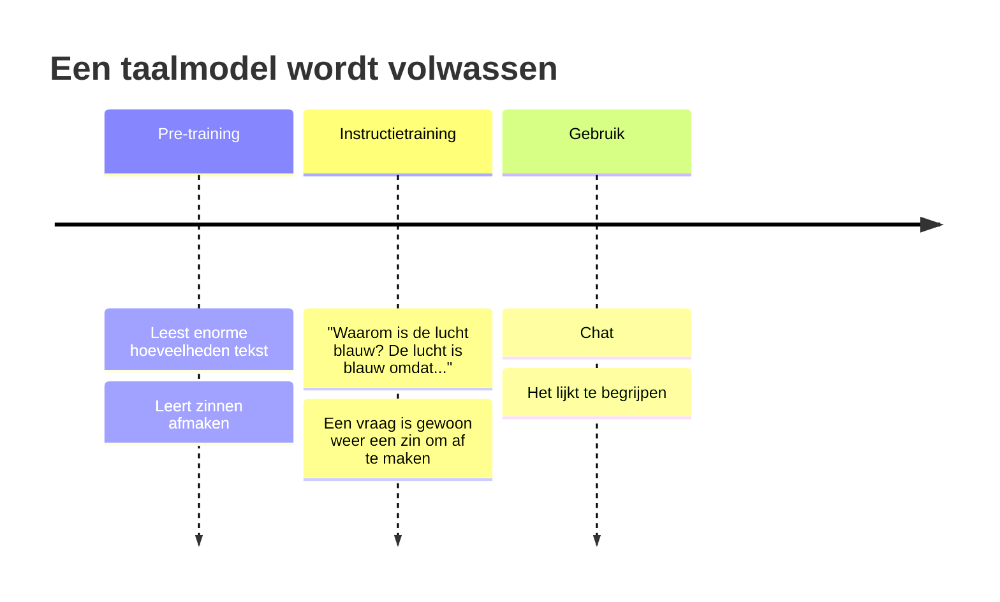

<!-- Alle taalmodellen beginnen als completion. Instructietraining maakt van "afmaken" een "antwoorden". -->

---

## datasets en hoeveel is "veel"?
* pretraining: https://huggingface.co/datasets/HuggingFaceFW/fineweb 
    * (52,453,695,892 rijen: 52B, 15T tokens)
* instruct training: https://huggingface.co/datasets/HuggingFaceTB/OpenHermes-2.5-H4 
    * (1,001,551: rijen 1M, 500M tokens)
* mijn dataset uit 2024 Leesplank B1 vereenvoudigingen: https://huggingface.co/datasets/UWV/Leesplank_NL_wikipedia_simplifications_preprocessed 
    * (2,694,555 rijen: 2.7M, 600M tokens; Heel Nederlandse wikipedia + vereenvoudiging)
* trainingsdata voor het model dat we zodadelijk gebruiken (granite 4.0 micro): 15T tokens
* Hoe groter het model, hoe meer trainingsdata het nodig heeft.
---

## Kennis van buiten het model: het boek

Hele boeken meegeven kan, maar:

- Kost **tijd en energie**
- Te veel context = **ruis**; het model werkt met statistiek
- Wat je niet nodig hebt, **verstoort**

**Dus: geef alleen het stuk dat nodig is.** Maar welk stuk?

---

# Deel 3
## De RAG-keten, stap voor stap

---

## Overzicht

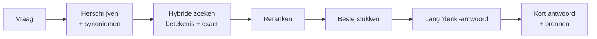

<!--
Laat dit staan als anker. Aan het eind herhalen we het. We lopen de blokken af, in een andere volgorde dan ze draaien: eerst de voorbereiding (chunken, embeddings), dan het zoeken.
-->

---

## Voorbereiding 1: chunking

Een boek knippen in stukjes waar net **genoeg** in staat om een antwoord op te baseren, en die je terugvindt bij elke relevante vraag.

- Hoofdstukken helpen al, maar daarin gebeurt nog veel
- Te groot: ruis. Te klein: context mist
- Chunking is een zelfstandig vakgebied

<!-- Handje op: "het maakt niet uit hoe groot of klein de stukjes zijn." -->

---

## Chunking in FormIt

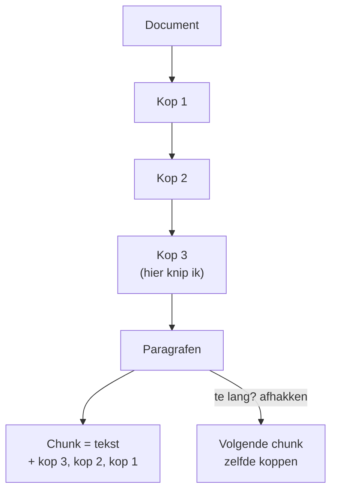

<!-- Elke chunk behoudt zijn plek in het document. Maximumlengte: te veel woorden = afkappen, zelfde kopjes mee. -->

---

## Waarom de corpus ertoe doet

Niet alleen "goed opgemaakt", maar:

- **Eenduidig**
- **Niet tegenstrijdig**
- **Niet verouderd**
- **Machine-_vriendelijke_ structuur** (kopjes, subkopjes)

*Rommel erin = grote meurende beerputbrand eruit.*

<!-- Brug naar later: jullie kunnen zelf een toepassing bouwen, en begint bij je documenten. -->

---

## Voorbereiding 2: betekenis in cijfers

Stel je een **veld met pijltjes** voor. Elk woord of frase heeft een pijltje.

Kies "goed": wie wijst dezelfde kant op?

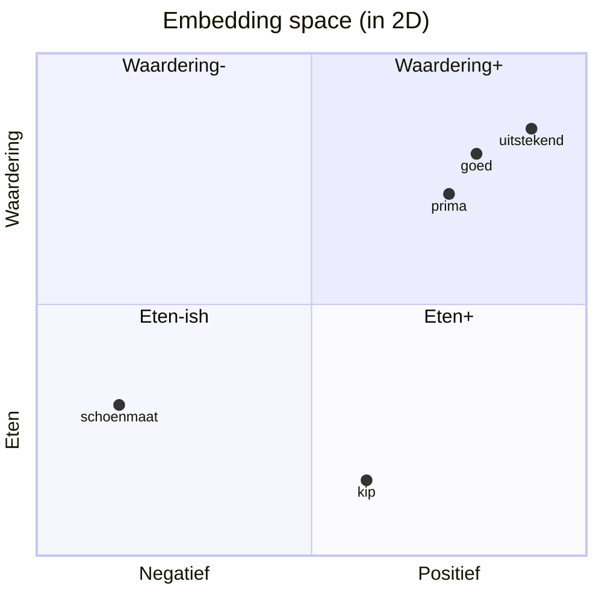

<!--
"Prima" en "uitstekend" liggen dicht bij "goed", "kip" en "schoenmaat" niet. In 2D te ruw, maar met honderden/duizenden dimensies werkt het.
-->

---

## embedding in het echt
* Granite heeft 2560 dimensies
* Wederom: een vakgebied op zich

---

## Embedding space en embedding-modellen

- Het veld met pijltjes = **embedding space**
- Maken kost **veel rekenkracht**, en elk taalmodel deed dat opnieuw
- **Embedding-modellen**: nemen een tekst, geven **één pijltje** terug

<!-- Handje op: "zoeken op betekenis is altijd beter dan zoeken op exacte woorden." (Spoiler: nee.) -->

---

## Zoeken: ongeveer én precies

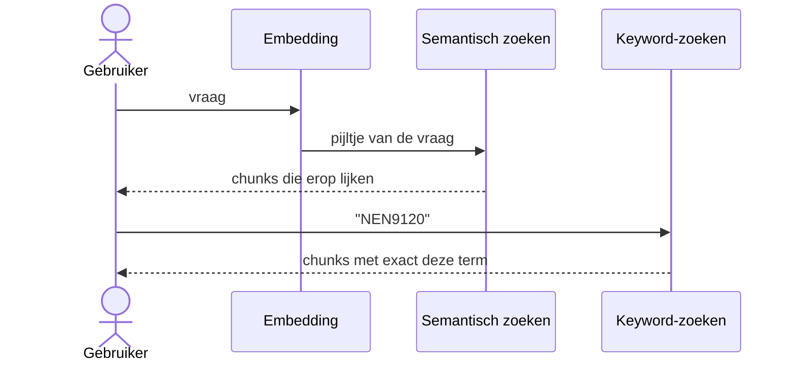

- **Semantisch**: dichtbij in betekenis
- **Keyword**: exact (NEN9120, typenummers)
- Samen: **hybride zoeken**, maar nu een gemengde resultatenset

---

## Reranking: de redder in nood

Een AI-model beoordeelt per chunk: **"kan dit de vraag beantwoorden?"**

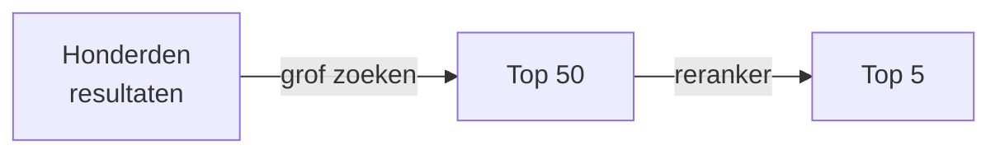

Een **tweetrapsraket**: eerst grof, dan precies.

<!-- Handje op: "de volgorde van de gevonden stukken is niet zo belangrijk." -->

---

## De vraag is anders dan het antwoord

Vraag: *"Waar staat de Euromast?"*
Chunk: *"De Euromast, gebouwd in 1960, ontworpen door ... gefinancierd door ..."*

De vraag staat **er niet letterlijk in**. En "bankje"? Park, woonkamer of bank?

**Oplossing: query expansion**
- Synoniemen uit een lijst
- Een gegokte beschrijving van hoe een antwoord eruit kan zien
- Taxonomie: kantoorgebouw → gebouw, Rotterdam → Zuid-Holland

<!-- Werkt ook voor gewone zoekmachines. Handje op: "als ik de vraag eerst herschrijf, vind ik betere stukken." -->

---

# Pauze ☕ 10 minuten

---

## Zijstapje: tools

Sommige kennis kan **niet uit een document** komen:

- Regenkans morgen → API van het KNMI
- Hoe vaak komt de **R** voor in "strawberry"? → een stukje code

De AI gebruikt een **gewoon programma** en verwerkt de uitkomst.

*Dit heet tool-use. Een verhaal voor een andere keer.*

---

## OK, en dan? Denken en "chicklets"

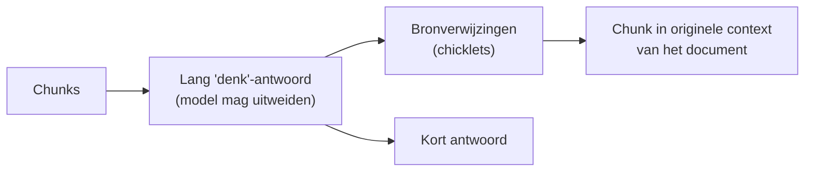

- Klik op een chicklet: zie de chunk **in het document**
- Controleren is snel; dat is **vertrouwen verdienen**

<!-- Handje op: "ik wil de brontekst liever in de context zien." -->

---

## Samenvatten en vervolgvragen

- Korte samenvatting + voorgestelde **vervolgvragen**
- Verder met **dezelfde set chunks**, of **opnieuw beginnen**
- Termen zijn **klikbaar** via de synoniemenlijst: een begrippenlijst / thesaurus in ontwikkeling

---

## De hele keten, nog eens

> vraag → herschrijven + synoniemen → hybride zoeken (betekenis + exact) → reranken → de beste stukken → lang 'denk'-antwoord → kort antwoord + klikbare bronnen → doorvragen of een heel document genereren

---

## demo tijd! (langere versie)
* filmpje  https://youtu.be/AXkbS8AO9nc 
* echte app https://okeribok.github.io/FormIt/
* vraag 
    * _"ik wil een toneelstuk schrijven over de geschiedenis van pasta. het moet historisch accuraat zijn. welke personages, gebeurtenissen en locaties zijn geschikt voor een dramatische vertelling?"_ in 12 talen
* daarna: "leg uit hoe de large hadron collider werkt" (zou moeten zeggen: "ik weet het niet")

---

## het bewijs van geavanceerde RAG: ik weet het niet
* Formit kan "ik weet het niet" zeggen, maar probeert het toch nog vaak.
* Het is best moeilijk om dit voor elkaar te krijgen, laat staan betrouwbaar.

---

## Internet zoeken: een ander verhaal

- Geen embeddings: gewoon **keyword-zoeken** (zoals Google)
- Herschrijven van de vraag is **belangrijker**: vaak meerdere zoekvragen
- Sites **blokkeren** robots
- Hele pagina's = één chunk; de reranker werkt anders
- Hoe beïnvloeden **gesponsorde resultaten** "zijn zonnebanken goed voor je?"

<!-- Handje op: "een AI-samenvatting van zoekresultaten is altijd neutraal." -->

---

## En Vlam-chat?

- Waar haalt Vlam-chat zijn kennis vandaan?
- Wat is de kennisgrens?
- Hoe gebruik je het dan voor **actuele** kennis?

<!-- Interactie: vraag de zaal. Eigen invulling per actuele stand van Vlam-chat; check vooraf wat het nu kan (zoeken, bronnen). -->

---

# Deel 4
## Van chat naar toepassing

---

## Een chat is veel werk

- Begint met een **knipperende cursor in een leeg tekstvak** 
- Steeds stap voor stap vragen stellen

Een **toepassing** legt het hele gesprek vast: herhaalbaar, stapsgewijs verbeterbaar.

*Vergelijk: één formule per keer met een in- en uitvoerveld vs. een complete spreadsheet met opmaak.*

---

## Applicatie: Document genereren: de recept-structuur

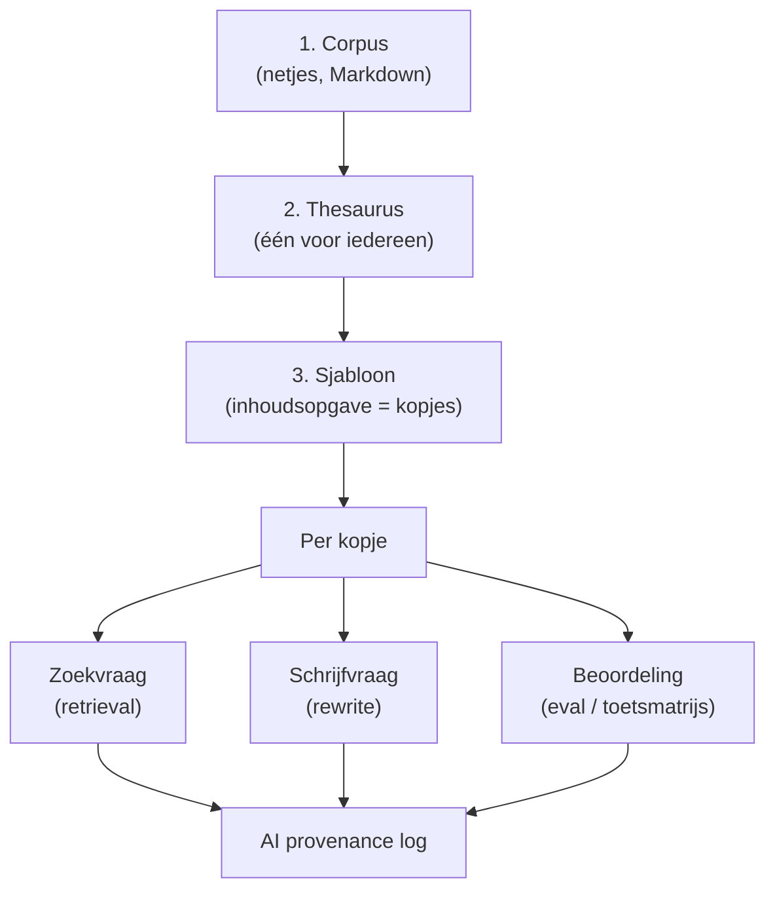

<!--
Corpus: kopjes en subkopjes, tekst alleen op het laagste niveau. Webpagina naar Markdown: r.jina.ai.
Eval: puntensysteem op compleetheid, stijl, etc. - eventueel met opnieuw zoeken.
Je kunt dit met collega's en stakeholders vooraf afspreken: welke informatie, stijl, kopjes en evaluatie ertoe doen. Dat levert al waarde op, nog zonder één watt AI.
Tot slot wordt per keer geregistreerd hoeveel tokens geconsumeerd en gegenereerd worden. Hier kun je een totaal aan energiebelasting mee berekenen bijvoorbeeld.
-->

---

## Wat zou jij willen genereren?

- Rapport?
- Checklist?
- Besluitnotitie?
- ...?

**Handje op 👋 als je nu al een idee hebt.**

<!-- Laat 2-3 mensen vertellen. Inspiratie: wat zou nog meer kunnen met dit principe? -->

---

## Slecht is het nieuwe goed

| | FormIt | Vlam | ChatGPT / Claude |
|---|---|---|---|
| Grootte | **3B** | 128B | ~1400B+ |
| Nederlands | matig | goed | goed |
| Talen | 12 | 40 | 95 |

- Gekke fouten vallen **goed op**, dus je checkt zelf
- Laptop-upgrade naar 8B: meer geheugen, trager, **veel beter**

<!--
Handje op: "hoe groter het model, hoe beter het altijd is voor mijn toepassing." Kies de modelgrootte per toepassing en team.
Let op: grootteverhoudingen zijn globaal; check actuele cijfers voor je presenteert.
-->

---

## Klein, taakgericht, configureerbaar: veiliger in het AI-tijdperk

| | Chat + wildgroei aan apps | Platform met taakgerichte toepassingen |
|---|---|---|
| 💨 **Reach** | Vrije tekst in een model met brede rechten: de *lethal trifecta* staat open | Vaste invoer, vaste taak, geen uitgaand kanaal (vliegtuigstand) |
| 🔥 **Flaw** | Elke nieuwe app is nieuw oppervlak en een nieuwe leverancier | Eén kleine kern (±2000 regels): te auditen, te herbouwen |
| ⛓️🧯 **Propagation / Beperken** | Eén gecompromitteerd gesprek raakt alles waar de gebruiker bij kan | Least-privilege per toepassing; schade blijft binnen één sjabloon |
| ✅ **Bewijzen** | Open invoer, open gedrag: niet te testen | Gesloten taak: toetsmatrijs (eval) per kopje, een harde 🧱 schil om een zacht 🎲 model |
| 👁️ **Zien** | Shadow AI en workarounds: geen overzicht | Eén platform, één logboek, één thesaurus |

**Veiligheid zit niet in de modelgrootte, maar in het beperkte mandaat. Een klein model in een smalle taak is de vorm waarin je dat mandaat kunt afdwingen.**

> Een platform is geen "probleempje-tooltje". Excel lost niet één probleem op maar een klasse problemen. Een chat is één cel, één formule, één uitvoer, en wat daar niet in past wordt een workaround.

<!--
Kern voor de CISO: een kleiner oppervlak is de structurele tegenzet uit het weerbaarheidsmodel (complexiteitsbudget, eenvoud als beveiligingsmaatregel). Wildgroei is geen vrijheid maar onzichtbaar oppervlak.
Eerlijkheid: een klein model is nog steeds te injecteren. De winst zit in de architectuur eromheen: de trifecta is doorbroken (geen egress, geen brede data, gestructureerde invoer) en het model zit in een deterministische schil die de rechten beheert. Zeg dit expliciet, anders kan een scherpe CISO de claim "klein = veilig" terecht afschieten.
Platform = hergebruik van barrières en één Definition of Done voor alle sjablonen. Let op concentratie: zwaar gevolg vraagt nog steeds onafhankelijkheid (common cause).
Voor managers: vraag niet "welk probleem lost dit op?" maar "welke klasse problemen, en wat gebeurt er met de workarounds als we dit níet bieden?"
-->
---

## FormIt: veiligheid, kosten, milieu

- **Vliegtuigstand**: alle gegevens blijven op je laptop, ook voor hoog-beveiligd
- **Soeverein**: onafhankelijk van leveranciers, versies, updates
- **Klein en ingebed**: ±2000 regels code in de browser sandbox
- **Milieu**: geen datacenter, en het kleinste model dat volstaat ≈ **500× minder** energie

<!-- Of het in 30 seconden of 6 minuten klaar is: maakt dat echt uit? En dan zijn er mensen die GPT gebruiken om woorden te tellen. -->

---

## Samenvatting van vandaag

1. ML = rekenen met voorbeelden, geen onthouden
2. Taalmodellen voorspellen woorden en kennen **grenzen**
3. RAG = **zoeken, rangschikken, dan schrijven met bronnen**
4. Jouw **corpus** bepaalt de kwaliteit
5. Van chat naar **herhaalbare toepassing**
6. Zelf aan de slag met RAG: https://okeribok.github.io/FormIt (documentatie op https://github.com/okeribok/formit/)

---
